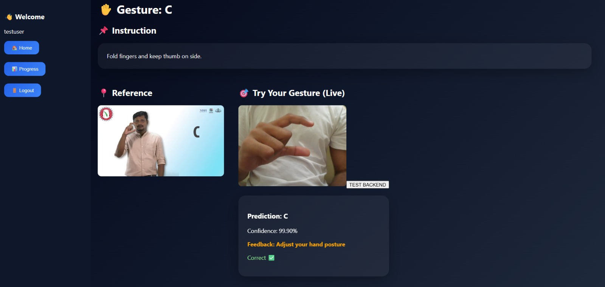
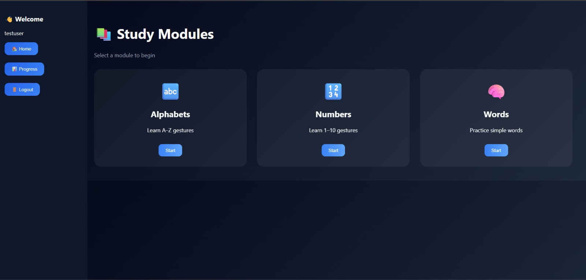
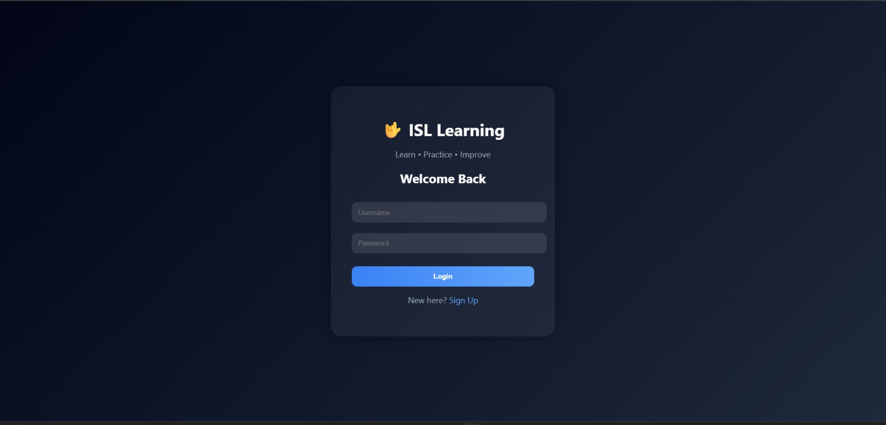

# 📖 SignLearn — Indian Sign Language Learning System

An interactive learning platform that helps users learn and practice Indian Sign Language (ISL) through real-time gesture recognition and instant feedback.

The application extracts 21 hand landmarks using MediaPipe Hands, preprocesses the landmark coordinates, and classifies the gesture using a trained Artificial Neural Network (ANN) model developed with TensorFlow/Keras. Users receive live predictions, confidence scores, corrective feedback, and progress tracking while practicing ISL alphabets and numbers.

The system is built with a React.js frontend for an interactive learning interface and a Flask backend that performs gesture recognition and communicates with the trained machine learning model.

---

## ✨ Features

- 📷 Real-time webcam-based gesture recognition
- ✋ Hand landmark extraction using MediaPipe
- 🧠 ANN-based gesture classification
- 🎯 Practice mode with live prediction
- 💬 Real-time corrective feedback
- 📊 Progress tracking and accuracy monitoring
- 🔢 Supports ISL alphabets and numbers
- 🌐 React + Flask full-stack architecture

---

## 🛠️ Tech Stack

**Frontend**
- React.js
- React Router
- React Webcam
- CSS

**Backend**
- Flask
- Flask-CORS
- OpenCV
- MediaPipe
- TensorFlow / Keras
- NumPy
- Pandas

**Machine Learning**
- Artificial Neural Network (ANN)
- Landmark-based feature extraction
- TensorFlow Keras
- Softmax classification

---

## ⚙️ System Workflow

1. Capture hand gesture using webcam.
2. Detect the hand using MediaPipe.
3. Extract 21 hand landmark coordinates.
4. Normalize and preprocess landmark features.
5. Classify the gesture using the trained ANN model.
6. Display predicted gesture and confidence score.
7. Generate corrective feedback based on gesture evaluation.
8. Update user progress for continuous learning.

---

## 📸 Screenshots

**Login**

**Home Dashboard**

**Study Modules**

**Alphabets Module**

**Live Gesture Practice**

**Progress Tracking**

---

## 🎯 Project Objective

To develop a learning platform that enables users to learn Indian Sign Language through vision-based gesture recognition, providing real-time prediction, corrective feedback, and progress tracking for an interactive and effective learning experience.

---

## 📌 Future Enhancements

- Support for complete ISL words and sentences
- Dynamic gesture recognition using LSTM/Transformer models
- Voice-assisted learning
- User authentication with cloud database
- Mobile application deployment
- Advanced personalized feedback using pose comparison

---

## 👨‍💻 Developed By

- **Jaine S Thomas**
- **Alan Kurian John**
- **Abishek S Ghosh**
- **M S Mohemmed**
